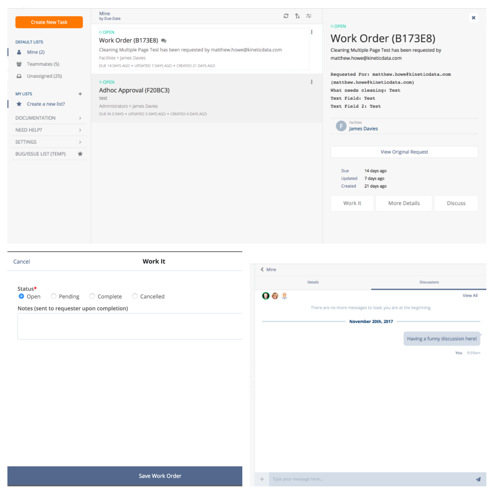

# Queue
The Queue Kapp is a work management system build on Kinetic Request CE. Work items can be tasks, approvals, cases or any combination that make up a fulfillment process. Queue helps organize your todo's into lists of work to be completed, and allows you to spawn off ad-hoc work items, and invite others to work on an item with you.

## Kapp Configuration References
The Queue Application leverages different type of Kinetic Request CE configurations for driving logic within the App. These configurations have been outlined below.

### Form Fields Reference
Field Name  | Field Type | Description
----------  | ----------- | -----------
Assigned Individual | Text | Stores the username of who the Task is assigned to
Assigned Individual Display Name | Text | Stores the Display Name of who the Task is assigned to
Assigned Team       | Text | Stores the full path to which team the Task is assigned to
Assigned Team Display Name | Text | Stores the Display Name of which team the Task is assigned to
Cancelation Reason  | Text | If a task is in a `Cancelled` status, this field is required and displayed in the App
Deferral Token    | Text | Stores the token used to relate this task to the process that initiated it (Typically only used with `Automated` type Tasks)
Details | Text | This field should provide any details needed for the assignee to complete the Task
Discussion Id  | Text | Stores the ID of the tasks related Discussion
Due Date | Date/Time | This field is used to display when the task needs to be completed by
Observing Teams | Checkbox | Used to control security and which teams are able to view the Task
Observing Individuals | Checkbox | Used to control security and which users are able to view the Task
Pending Reason | Text | If a task is in a `Pending` status, this field is required and displayed in the App
Resolution | Text | If a task is in a `Complete` status, this field is displayed and should provide an outcome. (e.g. for an Approval, this field may display the Decision)
Scheduled Date | Date/Time | This field is used to store and display when the task is scheduled to be completed
Summary | Text |This field should give a high level description of what the Task is for
Status      | Select | There are 4 valid Status options in Queue for all types of tasks. **In Progress** **Pending** **Complete** **Cancelled**

### Form Type Reference
Form Types are used to group forms within Kinetic Request CE. The following Form Types have been defined within the Queue app.
1. Automated -- Automated Forms are forms that are created via workflow (Kinetic Task Processes). These forms do not show up when clicking the "Create New Task" button, or when creating a new sub-task as they are designed to be created via workflow.
2. Task -- Forms of type `Task` will show up when creating a new Task from within the Queue App. These forms are also able to be subtasks.
3. Subtask -- Forms of type `Subtask` will only show up when creating a Subtask from a parent Task.
4. Template -- Forms of type `Template` are used for creating new Tasks within the Queue System, and are configured with all required fields.
* All Tasks are Subtasks, but Subtasks are not Tasks

### Attribute Reference
Attributes in Kinetic Request CE are like variables that can be tied to any object within the application. For example, a Kapp can have an attribute called "Icon" which dictates what Icon should display when referencing the Kapp within the User Interface. Below is a listing of all attributes and what they control within the Queue Kapp.

Certain attributes (noted below with `**`) have been defined at the Space, Kapp and Form levels. This means, that if the attribute exists at the `Form` level, it will override the attribute value set at the `Kapp` level...etc. The Space is the "highest" level, and then "Kapp" then "Form".

#### Kapp Attributes
Attribute Name | Description     | Example
-------------- | --------------  | --------------
Icon           | The [Font Awesome Icons](http://fontawesome.io/icons/) Font Awesome icon used to represent this kapp. | `fa-list-ul`
Description    | A short description of what this kapp is used for, typically displayed on the Kapp Listing (home) Page | `When you have work to do, you’ll see it here. Queue helps teams get work done in a snap.`
Owning Team   | The Owning Team attribute is used to control who has access to administer the kapp. Users that are a part of the team set here can create new forms, and update the Kapp's settings. | `Queue Admins`
_**Notification Template Name - Create_ | The Name of the Notification Template to use when a Task in Queue is been created | `Task Created`
_**Notification Template Name - Complete_ | The Name of the Notification Template to use when a Task in Queue is been submitted | `Task Completed`

#### Form Attributes
Attribute Name | Description     | Example
-------------- | --------------  | --------------
Icon           | The [Font Awesome Icons](http://fontawesome.io/icons/) Font Awesome icon used to represent this Form within the app. | `fa-tasks`
Assignment Type | Dictates if the App should present an assignment selector before displaying a form. If not set on a given form, the App will present a Assignment Selector before displaying the form when creating the Task. If set to `None` the form builder will need to display the `Assigned Team` / `Assigned Individual` fields or default them. | `None`
Discussion Id | The Id of the Discussion related to this form. Typically where form owners can collaborate on form changes. | `<discussion guid>`
Owning Team   | Dictates who can create a new task using this form from within the app. If left blank, anyone with access to the Queue App can create new tasks using this form.  | `Human Resources`
Permitted Subtasks | Dictates which subtasks are allowed to be created / related to tasks that use this form. If left blank, any sub-tasks can be added to tasks created with this form. This attribute allows multiple values which should be the `Form Slug` of the desired sub-task | `adhoc-approval`
Prohibit Subtasks | Setting this value to `True` will not allow a user to create sub-tasks on a task created using this form. | `True`
_**Notification Template Name - Create_ | The Name of the Notification Template to use when a Task for this form is created | `Task Created`
_**Notification Template Name - Complete_ | The Name of the Notification Template to use when a Task for this form is submitted | `Task Completed - Ad-hoc Task`
