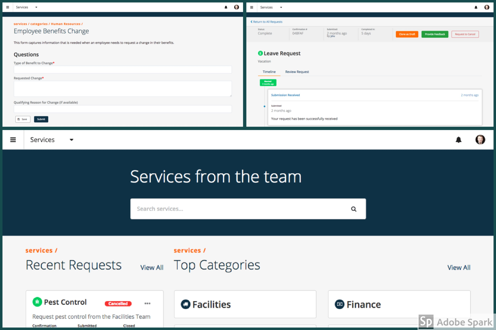

# Services
The Services Kapp is designed to be a place for internal or external users you request things from teams within an organization. This is also where a user can go to review or follow-up on existing requests.

## Kapp Configuration References
The Services Application leverages different type of Kinetic Request CE configurations for driving logic within the App. These configurations have been outlined below.

### Form Fields Reference
Field Name  | Field Type | Description
----------  | ----------- | -----------
Discussion Id  | Text | Stores the ID of the tasks related Discussion
Observing Teams | Checkbox | Used to control security and which teams are able to view the Task
Observing Individuals | Checkbox | Used to control security and which users are able to view the Task
Requested By | Text | Stores the username of the person who actually made this request
Requested By Display Name | Text | Stores the Display Name of the person who actually made this request
Requested For | Text | Stores the username of the person this request is for
Requested For Display Name | Text | Stores the Display Name of the person this request is for
Status | Text | The status of this request. Typically set by workflow automatically and defaulted to `Draft`

### Form Type Reference
Form Types are used to group forms within Kinetic Request CE. The following Form Types have been defined within the Services app.
1. Service -- Any form that is requestable within the app. These forms will show up in Categories and submissions for these forms will be displayed in the `My Requests` area of the app.
2. Template -- Template forms can be used as a starting place for creating new services. Once you `Clone` a template, change the Type to `Service` and set it's status to `Active` for it to show up in the portal.
3. Utlitiy -- Utility Type forms are used for console activities and will not be displayed as *Requestable* or show up in the `My Requests` area of the app. Common utility forms are `Comment` to comment on something previously submitted...etc.

### Attribute Reference
Attributes in Kinetic Request CE are like variables that can be tied to any object within the application. For example, a Kapp can have an attribute called "Icon" which dictates what Icon should display when referencing the Kapp within the User Interface. Below is a listing of all attributes and what they control within the Services Kapp.

Certain attributes (noted below with `**`) have been defined at the Space, Kapp and Form levels. This means, that if the attribute exists at the `Form` level, it will override the attribute value set at the `Kapp` level...etc. The Space is the "highest" level, and then "Kapp" then "Form".

#### Kapp Attributes
Attribute Name | Description     | Example
-------------- | --------------  | --------------
_**Approver_ | Options are: a Team Name, a Users username, `manager` or `none`. If this is set, all forms in this kapp will get approvals sent to the value set here unless specified in a form. | `none`
_**Approval Form Slug_ | The form slug for which approvals should be created in (if not defined on form) | `approval`
Description    | A short description of what this kapp is used for, typically displayed on the Kapp Listing (home) Page | `Browse, request and check status of services`
Discussion Id | The Id of the Discussion related to this kapp. Typically where kapp owners can collaborate on suggestions or changes. | `<discussion guid>`
_**Form Workflow_ | Defines which workflow type should be executed for each type of action. All values should be prefixed with an action (Created, Deleted, Updated) Workflow types are (Standard, True, False, or a custom process name) Example (Created - False | Deleted - True | Updated - My Custom Process) | `Updated - False`
Record Search History | This attribute controls when searches made from this kapp are recorded. Options are All (all searches will be recorded) / None (Only record when no results found) / Off (never record search history) | `All`
Icon           | The [Font Awesome Icons](http://fontawesome.io/icons/) Font Awesome icon used to represent this kapp. | `fa-book`
Owning Team   | The Owning Team attribute is used to control who has access to administer the kapp. Users that are a part of the team set here can create new forms, and update the Kapp's settings. | `Services Admins`
_**Notification Template Name - Create_ | The Name of the Notification Template to use when a Form in this kapp has been created | `Service Submitted`
_**Notification Template Name - Complete_ | The Name of the Notification Template to use when a Form in this kapp has been submitted | `Service Completed`
_**Service Days Due_ | Number of days until service is expected to be fulfilled for forms in this Kapp - This attribute can be overridden if set at the form level | `7`
_**Submission Workflow_ | Defines which workflow type should be executed for each type of action. All values should be prefixed with an action (Submitted, Created, Updated, Deleted) Workflow types are (Standard, True, False, or a custom process name) This attribute can be overridden by a form's attribute Example (Submitted - False | Submitted - True | Submitted - My Custom Process) | `Submitted - True`
_**Task Assignee Individual_ | User to assign tasks to for forms submitted within this kapp (typically set at the form level if applicable) | ``
_**Task Assignee Team_ | Team to assign tasks to for forms submitted within this kapp (typically set at the form level if applicable) | `Default`
_**Task Form Slug_ | The slug of the form to use when creating a task item. (If set here, all forms in this kapp, unless specified at the form level will have tasks created in the form set here) | `work-order`

#### Form Attributes
Attribute Name | Description     | Example
-------------- | --------------  | --------------
_**Approver_ | Options are: a Team Name, a Users username, `manager` or `none`. | `none`
_**Approval Form Slug_ | The Queue kapp form which approvals related to this form should be created in (Kapp setting is used if not set here) | `approval`
Description | A short description of what this kapp is used for, typically displayed on the Kapp Listing (home) Page | `Need something from HR? Request it here!`
Discussion Id | The Id of the Discussion related to this form. Typically where form owners can collaborate on suggestions or changes. | `<discussion guid>`
Cancel Disabled | This attribute controls whether or not submissions for this form can be canceled. If set to true, the Request to Cancel button will not display. | `true`
Cloning Disabled | This attribute controls whether or not submissions for this form can be cloned. If set to true, the Clone as Draft button will not display. | ``
Comment Disabled_ | This attribute controls whether or not submissions for this form can have comments added. If set to true, the Add Comment button will not display. | `true`
_**Form Workflow_ | Defines which workflow type should be executed for each type of action. All values should be prefixed with an action (Created, Deleted, Updated) Workflow types are (Standard, True, False, or a custom process name) Example (Created - False | Deleted - True | Updated - My Custom Process) | `Updated - False`
Icon | The [Font Awesome Icons](http://fontawesome.io/icons/) Font Awesome icon used to represent this form. | `fa-truck`
Owning Team | The Owning Team attribute is used to control who has access to manage this service (form). Users that are a part of the team set here can update this form. | `HR`
_**Notification Template Name - Create_ | The Name of the Notification Template to use when a Form in this kapp has been created | `Service Submitted`
_**Notification Template Name - Complete_ | The Name of the Notification Template to use when a Form in this kapp has been submitted | `Service Completed`
_**Service Days Due_ | Number of days until service is expected to be fulfilled - Defaults to Kapp Attribute if not set here. | `7`
_**Submission Workflow_ | Defines which workflow type should be executed for each type of action. All values should be prefixed with an action (Submitted, Created, Updated, Deleted) Workflow types are (Standard, True, False, or a custom process name) This attribute can be overridden by a form's attribute Example (Submitted - False | Submitted - True | Submitted - My Custom Process) | `Submitted - True`
_**Task Assignee Individual_ | User to assign tasks to when this form is submitted. | ``
_**Task Assignee Team_ | Team to assign tasks to when this form is submitted. | `HR`
_**Task Form Slug_ | The form to use when creating a fulfillment task for this item | `work-order`

#### Category Attributes
Attribute Name | Description     | Example
-------------- | --------------  | --------------
Discussion Id | The Id of the Discussion related to this category. Typically where form owners can collaborate on suggestions or changes to forms within this category. | `<discussion guid>`
Hidden | If this category should be hidden from the category list. | `Home Page Services`
Icon | The [Font Awesome Icons](http://fontawesome.io/icons/) Font Awesome icon used to represent this category. | `fa-truck`
Label | The Display Label used to represent this category. | `Human Resources`
Parent | If this is a subcategory, the category slug of the parent category | `Hardware`
Sort Order | The order in which this category should be displayed within the kapp | `1`
ices*.).
