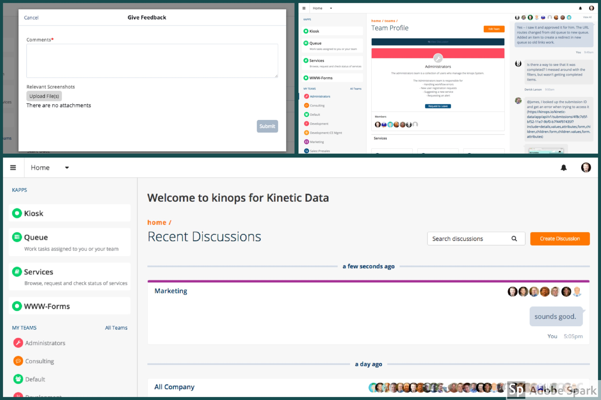

# Space
The Space bundle is designed to be a launching point for all other Kapps in the system. Within the space bundle, you can see a list of discussions you are involved in, access other kapps, update your profile, and browse/update teams.

## Space Configuration References
The Space bundle leverages different type of Kinetic Request CE configurations for driving logic within the App. These configurations have been outlined below.

### Attribute Reference
Attributes in Kinetic Request CE are like variables that can be tied to any object within the application. For example, a Kapp can have an attribute called "Icon" which dictates what Icon should display when referencing the Kapp within the User Interface. Below is a listing of all attributes and what they control within the Services Kapp.

Certain attributes (noted below with `**`) have been defined at the Space, Kapp and Form levels. This means, that if the attribute exists at the `Form` level, it will override the attribute value set at the `Kapp` level...etc. The Space is the "highest" level, and then "Kapp" then "Form".

#### Space Attributes
Attribute Name | Description     | Example
-------------- | --------------  | --------------
_**Approver_ | Options are: a Team Name, a Users username, `manager` or `none`. If this is set, all forms in this kapp will get approvals sent to the value set here unless specified in a form. | `none`
_**Approval Form Slug_ | The form slug for which approvals should be created in (if not defined on form) | `approval`
Description    | A short description of what this kapp is used for, typically displayed on the Kapp Listing (home) Page | `Browse, request and check status of services`
Discussion Id | The Id of the Discussion related to this kapp. Typically where kapp owners can collaborate on suggestions or changes. | `<discussion guid>`
_**Form Workflow_ | Defines which workflow type should be executed for each type of action. All values should be prefixed with an action (Created, Deleted, Updated) Workflow types are (Standard, True, False, or a custom process name) Example (Created - False | Deleted - True | Updated - My Custom Process) | `Updated - False`
Record Search History | This attribute controls when searches made from this kapp are recorded. Options are All (all searches will be recorded) / None (Only record when no results found) / Off (never record search history) | `All`
Icon           | The [Font Awesome Icons](http://fontawesome.io/icons/) Font Awesome icon used to represent this kapp. | `fa-book`
Owning Team   | The Owning Team attribute is used to control who has access to administer the kapp. Users that are a part of the team set here can create new forms, and update the Kapp's settings. | `Services Admins`
_**Notification Template Name - Create_ | The Name of the Notification Template to use when a Form in this kapp has been created | `Service Submitted`
_**Notification Template Name - Complete_ | The Name of the Notification Template to use when a Form in this kapp has been submitted | `Service Completed`
_**Service Days Due_ | Number of days until service is expected to be fulfilled for forms in this Kapp - This attribute can be overridden if set at the form level | `7`
_**Submission Workflow_ | Defines which workflow type should be executed for each type of action. All values should be prefixed with an action (Submitted, Created, Updated, Deleted) Workflow types are (Standard, True, False, or a custom process name) This attribute can be overridden by a form's attribute Example (Submitted - False | Submitted - True | Submitted - My Custom Process) | `Submitted - True`
_**Task Assignee Individual_ | User to assign tasks to for forms submitted within this kapp (typically set at the form level if applicable) | ``
_**Task Assignee Team_ | Team to assign tasks to for forms submitted within this kapp (typically set at the form level if applicable) | `Default`
_**Task Form Slug_ | The slug of the form to use when creating a task item. (If set here, all forms in this kapp, unless specified at the form level will have tasks created in the form set here) | `work-order`
